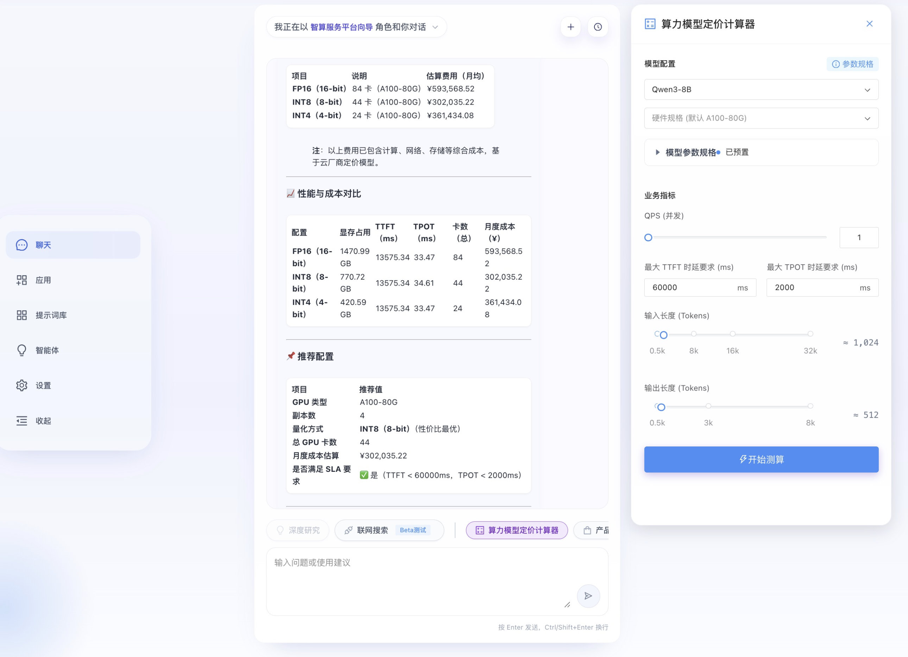

<div align="center">

# ζ0Hub · CookBook

**Zeta Zero Hub 代码烹饪书**

[](https://github.com/ZetaZeroHub)
[](https://zzh.app)
[](https://zzh.app/githave)
[](https://zzh.app/flash-memory)

</div>

---

### AIChatWeb 前后端系统部署指南

> **AIChatWeb** 是一套面向智算服务平台的 AI 对话系统，集成了 AI Chatbot、Agent 编排、MCP/Tool 注册中心、RAG 知识库问答、算力评估等能力，可供二次开发和私有化部署。



---

#### 一、整体架构

```
┌─────────────────────────────── 用户浏览器 ────────────────────────────────┐
│                                                                          │
│   mlops-front  (React + TypeScript + Arco Design)                        │
│   ┌────────────────────────────────────────────────────────────────────┐  │
│   │  AiChat 页面 (/pages/AiChat/index.tsx)                            │  │
│   │  ┌──────────┐ ┌──────────┐ ┌──────────┐ ┌──────────┐             │  │
│   │  │ 多会话管理│ │Agent选择 │ │MCP/Tool  │ │ 配置管理  │             │  │
│   │  │ 侧边栏   │ │ 切换器   │ │ 编辑器   │ │ConfigMgr │             │  │
│   │  └──────────┘ └──────────┘ └──────────┘ └──────────┘             │  │
│   │  ┌──────────────────────────────────────────────────────────┐     │  │
│   │  │         对话区 (Markdown渲染 / 流式输出 / 引用解析)       │     │  │
│   │  └──────────────────────────────────────────────────────────┘     │  │
│   │  ┌──────────────────────────────────────────────────────────┐     │  │
│   │  │  输入区 (语音/文本 + 模型选择 + Agent/Web搜索/深度思考)   │     │  │
│   │  └──────────────────────────────────────────────────────────┘     │  │
│   └────────────────────────────────────────────────────────────────────┘  │
│          │  HTTP / SSE (fetch + EventStream)                              │
│          │  路由前缀: /chat/api/v1/*                                      │
└──────────┼───────────────────────────────────────────────────────────────┘
           │
           ▼
┌──────────────────────── githave-gateway (Go + Gin) ───────────────────────┐
│                                                                           │
│  [API 网关层]                                                             │
│  ┌─────────────────────────────────────────────────────────────────────┐  │
│  │  中间件: JWT认证 │ 令牌桶限流 │ CORS │ 日志                         │  │
│  └─────────────────────────────────────────────────────────────────────┘  │
│                                                                           │
│  ┌─────────────┐ ┌──────────────┐ ┌──────────────┐ ┌───────────────┐     │
│  │ 认证模块     │ │ Chat/Agent   │ │ 会话管理     │ │ MCP/Tool/Agent│     │
│  │ - 密码注册   │ │ Completions  │ │ - CRUD       │ │ 注册中心      │     │
│  │ - 邮箱验证码 │ │ - 流式/非流式│ │ - 历史消息   │ │ - CRUD管理    │     │
│  │ - OAuth2     │ │ - SSE事件推送│ │ - 分页查询   │ │ - 动态注册    │     │
│  │ - Google     │ │              │ │              │ │               │     │
│  │ - GitHub     │ │              │ │              │ │               │     │
│  └──────┬───────┘ └──────┬───────┘ └──────┬───────┘ └───────────────┘     │
│         │                │                │                               │
│  ┌──────┴────────────────┴────────────────┴──────────────────────────┐    │
│  │  PostgreSQL (GORM)  ←→  数据持久化层                              │    │
│  │  User │ Session │ Message │ CallRecord │ Agent │ MCP │ Tool       │    │
│  └───────────────────────────────────────────────────────────────────┘    │
│         │                                                                 │
│         │  HTTP 代理转发 (模型调用)                                        │
│         ▼                                                                 │
│  ┌───────────────────────────────────────────────────────────────────┐    │
│  │  模型提供者路由: OpenAI / DeepSeek / Qwen / 自定义 LLM            │    │
│  │  ┌──────────────┐ ┌──────────────┐ ┌──────────────┐              │    │
│  │  │ OpenAI API   │ │ DeepSeek API │ │ vLLM / 本地  │              │    │
│  │  └──────────────┘ └──────────────┘ └──────────────┘              │    │
│  └───────────────────────────────────────────────────────────────────┘    │
│         │                                                                 │
│         │  RAG 知识库调用 (HTTP)                                          │
│         ▼                                                                 │
└─────────┼─────────────────────────────────────────────────────────────────┘
          │
          ▼
┌────────────────── cfn_chatbot (Python + Langchain-Chatchat) ──────────────┐
│                                                                           │
│  [AI 知识库模块 — RAG 问答系统]                                           │
│  ┌─────────────────────────────────────────────────────────────────────┐  │
│  │  API 服务层 (FastAPI, 端口 7863)                                    │  │
│  │  /knowledge_base/chat  │  /role/chat  │  /recommend  │  /chatbi    │  │
│  └───────────┬───────────────────────────────────────────┬─────────────┘  │
│              │                                           │                │
│  ┌───────────▼──────────┐              ┌─────────────────▼────────────┐   │
│  │  RAG Pipeline        │              │  意图识别 & 推荐引擎          │   │
│  │  ┌────────────────┐  │              │  - 兜底问答                  │   │
│  │  │ 文档加载/切分   │  │              │  - 产品推荐                  │   │
│  │  │ (Word/Excel/PDF)│  │              │  - 资源查询 (ChatBI)         │   │
│  │  ├────────────────┤  │              │  - 算力评估                  │   │
│  │  │ Embedding向量化 │  │              └────────────────────────────┘   │
│  │  │ bge-large-zh    │  │                                              │
│  │  ├────────────────┤  │                                              │
│  │  │ 向量库检索      │  │                                              │
│  │  │ (FAISS/Milvus)  │  │                                              │
│  │  ├────────────────┤  │                                              │
│  │  │ Reranker重排序  │  │                                              │
│  │  │ bge-reranker    │  │                                              │
│  │  ├────────────────┤  │                                              │
│  │  │ LLM 生成回答    │  │                                              │
│  │  └────────────────┘  │                                              │
│  └──────────────────────┘                                              │
│                                                                         │
└─────────────────────────────────────────────────────────────────────────┘
```

##### 数据流概览

```
用户输入 ──▶ mlops-front ──▶ githave-gateway ──┬──▶ LLM API (通用对话)
                                                │
                                                ├──▶ cfn_chatbot (RAG知识库问答)
                                                │
                                                └──▶ Agent SSE (事件流推送)
                                                        │
                                                        ▼
                                                  前端实时渲染回答
```

---

#### 二、子模块一览

| 子模块 | 技术栈 | 仓库地址 | 主要职责 |
|:---|:---|:---|:---|
| **mlops-front** | React 16 + TypeScript + Webpack + Arco Design | [ZetaZeroHub/mlops-front](https://github.com/ZetaZeroHub/mlops-front) | 前端 UI 界面，AiChat 对话交互 |
| **githave-gateway** | Go 1.16+ + Gin + GORM + PostgreSQL | [ZetaZeroHub/githave-web](https://github.com/ZetaZeroHub/githave-web) (子模块 `githave-gatway`) | API 网关、用户认证、模型代理、会话管理 |
| **cfn_chatbot** | Python 3.10+ + Langchain-Chatchat + FastAPI | [ZetaZeroHub/cpcnc-pricing-repository](https://github.com/ZetaZeroHub/cpcnc-pricing-repository) (子项目 `cfn_chatbot`) | RAG 知识库问答、意图识别、算力评估 |

---

#### 三、开发环境部署（手把手指南）

##### 3.1 前端 — mlops-front

###### 环境要求

| 依赖 | 版本要求 | 推荐版本 |
|:---|:---|:---|
| Node.js | 14.x 或 16.x (React 16 兼容) | v20.17.0 |
| yarn | 1.x | 1.22.22 |

###### 步骤

```bash
# 1. 克隆项目
git clone https://github.com/ZetaZeroHub/mlops-front.git
cd mlops-front

# 2. 安装依赖
yarn install

# 3. 配置开发环境代理 (将 /chat/api/v1 转发到后端网关)
#    编辑 config/webpack.dev.js，在 devServer.proxy 中添加:
#    '/chat': {
#      target: 'http://localhost:5202',   ← githave-gateway 地址
#      changeOrigin: true,
#    }

# 4. 启动开发服务器
yarn start
# 进入项目：http://localhost:8373/ai_chat

```

###### 核心目录结构

```
src/pages/AiChat/
├── index.tsx            # 主页面入口 (6700+ 行，包含完整对话 UI)
├── api/
│   └── index.ts         # 统一 API 调用层 (sessionsAPI / modelAPI / mcpAPI / agentsAPI)
├── apps/
│   └── registry.ts      # 内置应用注册
├── components/
│   ├── ConfigManager.tsx # 配置文件管理（远程编辑 .env 等）
│   ├── McpOptionEditor.tsx # MCP 选项编辑器
│   └── useAuth.ts       # 认证 Hook (JWT Token 管理)
└── style/
    └── index.less       # 样式
```

###### 前端功能列表

- 🧠 **多智能体切换** — 内置"智算平台向导"、"算网定价引擎"，支持自定义 Agent
- 💬 **多会话管理** — 创建/切换/删除/重命名会话，会话持久化
- 🌊 **流式输出 (SSE)** — 实时流式渲染 AI 回答，支持 Markdown/代码高亮/表格
- 🔍 **Web 搜索模式** — 集成 open-websearch MCP，支持联网检索
- 🧩 **MCP & Tool 配置** — 可视化管理 MCP 服务端和工具注册
- 📊 **引用解析** — 自动解析参考文献，悬浮气泡展示标题和链接
- 🎨 **3D 动画首页** — Three.js 渲染粒子场景，分组建议卡片轮播
- 🔧 **Agent 事件日志** — 实时展示 Agent 调用链的执行过程

---

##### 3.2 后端 — githave-gateway

###### 环境要求

| 依赖 | 版本要求 |
|:---|:---|
| Go | 1.16+ |
| PostgreSQL | 12+ |
| Redis | 6.0+ |

###### 部署步骤

```bash
# 1. 克隆项目
git clone https://github.com/ZetaZeroHub/githave-web.git
cd githave-web/githave-gatway

# 2. 配置环境变量 (参考 .env.example)
cp .env.example .env
# 编辑 .env，至少配置以下必要项:
#   DB_HOST=localhost
#   DB_PORT=6073
#   DB_USER=postgres
#   DB_PASSWORD=your_password
#   DB_NAME=apigateway
#   REDIS_HOST=127.0.0.1
#   REDIS_PORT=6379
#   JWT_SECRET=your_secure_jwt_secret

# 3. 创建数据库并确保 Redis 运行
createdb apigateway   # 或在 psql 中执行: CREATE DATABASE apigateway;

# 4. 编译并启动
go run main.go
# 服务默认监听 :5202，助手服务监听 :5203
```

###### 核心环境变量速查

| 变量 | 说明 | 默认值 |
|:---|:---|:---|
| `PORT` | 主服务端口 | `5202` |
| `ASSISTANT_PORT` | 助手服务端口 | `5203` |
| `DB_HOST` | PostgreSQL 主机 | `localhost` |
| `DB_PORT` | PostgreSQL 端口 | `6073` |
| `DB_USER` | 数据库用户 | `postgres` |
| `DB_NAME` | 数据库名 | `apigateway` |
| `REDIS_HOST` | Redis 主机 | `127.0.0.1` |
| `REDIS_PORT` | Redis 端口 | `6379` |
| `JWT_SECRET` | JWT 签名密钥 | — |

###### 后端核心目录结构

```
githave-gatway/
├── main.go              # 应用入口
├── controllers/         # 控制器层 — HTTP 请求处理
├── services/            # 服务层 — 业务逻辑
├── models/              # 数据模型 (User / Session / Agent / MCP ...)
├── middlewares/         # 中间件 (JWT 认证 / 令牌桶限流)
├── routes/              # 路由定义 (/api/v1/*)
├── handlers/            # 请求处理器
├── migrations/          # 数据库迁移脚本
├── configs/             # 配置管理
├── docker-compose.yml   # Docker 编排
├── docs/                # Swagger API 文档
└── go.mod               # Go 模块依赖
```

###### 后端 API 接口概览

| 分类 | 接口路径 | 说明 |
|:---|:---|:---|
| 认证 | `POST /api/v1/register` | 用户注册 |
| 认证 | `POST /api/v1/login` | 密码登录 |
| 认证 | `POST /api/v1/login/email` | 邮箱验证码登录 |
| 认证 | `POST /api/v1/oauth/login` | OAuth2 登录 (GitHub/Google) |
| 对话 | `POST /api/v1/chat/completions` | 流式/非流式对话补全 |
| 对话 | `GET /api/v1/agent/events/{key}` | Agent SSE 事件流 |
| 会话 | `GET/POST/PUT/DELETE /api/v1/sessions` | 会话 CRUD |
| 智能体 | `GET/POST/PUT/DELETE /api/v1/agents` | Agent 管理 |
| MCP | `GET/POST/PUT/DELETE /api/v1/mcps` | MCP 服务注册 |
| 工具 | `GET/POST/PUT/DELETE /api/v1/tools` | 工具注册 |
| 模型 | `GET /api/v1/models/providers` | 获取模型提供者列表 |
| 用户 | `GET /api/v1/user/info` | 获取用户信息 |
| 充值 | `POST /api/v1/account/recharge` | 创建充值订单 |
| 邀请 | `POST /api/v1/invitation/generate` | 生成邀请码 |
| 文件 | `POST /api/v1/file/ftp/upload` | FTP 文件上传 |
| 搜索 | `GET /api/v1/search` | GitHub 仓库搜索 |
| 社区 | `GET /api/v1/community` | 社区话题列表 |

> 完整接口文档见 `githave-gatway/README.md` 或启动后访问 Swagger：`http://localhost:5202/swagger/index.html`

---

##### 3.3 AI 知识库 — cfn_chatbot

###### 环境要求

| 依赖 | 版本/要求 |
|:---|:---|
| Python | 3.10+ (推荐 Conda 管理) |
| GPU (推理) | 推荐 3060Ti×4 (32GB+ 总显存) |
| CPU (纯 API) | 至少 4 核 / 16GB 内存 |
| Docker (生产) | 20+ |

###### 步骤一：源码开发模式 (Conda)

```bash
# 1. 创建虚拟环境
conda create -n chatbot python=3.10
conda activate chatbot

# 2. 进入项目
cd cfn_chatbot

# 3. 分批安装依赖 (顺序重要!)
pip install -r requirements_core_cy2.txt
pip install -r requirements_rechat.txt
pip install -r requirements_api.txt
pip install -r requirements_lite.txt
pip install -r requirements_webui.txt
pip install -r requirements.txt

# 4. 升级核心库，避免包冲突
pip install --upgrade sentence-transformers huggingface-hub
pip install --upgrade accelerate peft dashscope
pip install xinference "pydantic<2"

# 5. 文档解析依赖
pip install openpyxl xlrd xlsxwriter
```

###### 步骤二：模型下载与配置

1. **Embedding 模型**：下载 `bge-large-zh-v1.5`，放置到 `MODEL_PATH["embed_model"]` 指定路径
2. **Reranker 模型**：下载 `bge-reranker-base`，放置到 `MODEL_PATH["reranker"]` 指定路径
3. **LLM 配置**：在 `configs/model_config.py` 中配置 `ONLINE_LLM_MODEL` / `LLM_MODELS`
4. **服务端口配置**：在 `configs/server_config.py` 中设置端口和外部服务地址

###### 步骤三：初始化与启动（开发环境自测）

```bash
# 初始化向量知识库
python init_database.py --recreate-vs

# 一键启动 (API + WebUI)
export ALLOW_MPS=1   # Mac M 系列芯片需要
python startup.py -a
# WebUI: http://127.0.0.1:8504
# API:   http://127.0.0.1:7863
```

###### 步骤四：Docker 生产部署

```bash
IMAGE_TAG="compute_force_network_chatbot:20250429_intent"

docker run -d \
  --name cfn_chatbot_prod \
  -v $(pwd)/scripts:/app/compute_force_network_chatbot/scripts \
  -v $(pwd)/knowledge_base:/app/compute_force_network_chatbot/knowledge_base \
  -v $(pwd)/configs/company_config:/app/compute_force_network_chatbot/company_config \
  -v $(pwd)/my_logs:/app/compute_force_network_chatbot/my_logs \
  -p 7863:7863 \
  ${IMAGE_TAG} \
  /bin/bash -c "nohup_start scripts/start_chatapi.sh my_logs/log_chatapi.log"
```

###### 联通性自测

```bash
cd scripts/test
sh test_llm.sh                         # 测试 LLM 连通性
python test_embed_model.py             # 测试 Embedding 模型
sh test_knowledge_chat.sh              # 测试 RAG 知识库问答
sh test_role_chat_recommend.sh         # 测试意图切换/推荐
sh test_role_chat_resource_query.sh    # 测试资源查询 (ChatBI)
sh test_role_chat_compute_evaluate.sh  # 测试算力评估
```

---

#### 四、三端联调指南

完成上述三个模块的独立部署后，需要进行联调：

##### 4.1 配置联调拓扑

```
┌──────────────┐     ┌──────────────────┐     ┌───────────────┐
│ mlops-front  │────▶│ githave-gateway  │────▶│ cfn_chatbot   │
│ :8373/ai_chat│     │ :5202            │     │ :7863         │
└──────────────┘     └──────────────────┘     └───────────────┘
```

##### 4.2 步骤

1. **启动 cfn_chatbot**（端口 7863）
2. **启动 githave-gateway**（端口 5202），在 `.env` 中配置 cfn_chatbot 的地址
3. **启动 mlops-front**（端口 8373），在 `webpack.dev.js` 中配置代理指向 gateway
4. 访问 `http://localhost:8373/ai_chat`，进入 AiChat 页面即可进行端到端对话

##### 4.3 验证清单

- [ ] 用户注册/登录正常
- [ ] 会话创建与切换正常
- [ ] 选择模型发送消息，流式输出正常
- [ ] Agent 事件日志正常展示
- [ ] 知识库问答（RAG）返回引用文献
- [ ] Web 搜索模式联网可用

---

#### 五、功能矩阵

##### 前端功能（mlops-front · AiChat）

| 功能 | 说明 | 二次开发 |
|:---|:---|:---|
| 多模型切换 | 支持 OpenAI / DeepSeek / Qwen 等模型动态选择 | ⭐⭐⭐ 简单 |
| 多 Agent 角色 | 内置向导、定价引擎，支持自定义 Agent CRUD | ⭐⭐⭐ 简单 |
| MCP 服务集成 | 可视化注册/编辑 MCP 端点与工具 | ⭐⭐ 中等 |
| 会话管理 | 多会话创建/删除/重命名，消息历史持久化 | ⭐⭐⭐ 简单 |
| 流式输出 | SSE 实时渲染，支持 Markdown / 代码 / 表格 / 引用 | ⭐⭐ 中等 |
| Web 搜索 | 联网搜索模式，支持搜索历史 | ⭐⭐ 中等 |
| 深度思考 | Thinking 模式，显示推理链路 | ⭐⭐ 中等 |
| 建议卡片 | 首页分组建议，引导式提问 | ⭐⭐⭐ 简单 |
| 配置管理 | 远程编辑后端配置文件 (.env / yml) | ⭐⭐ 中等 |

##### 后端功能（githave-gateway）

| 功能 | 说明 | 二次开发 |
|:---|:---|:---|
| 多种认证 | 密码 / 邮箱验证码 / GitHub OAuth / Google OAuth | ⭐⭐⭐ 简单 |
| JWT Token | 基于 JWT 的无状态认证 | ⭐⭐⭐ 简单 |
| 令牌桶限流 | 用户级别 5次/分钟，防止滥用 | ⭐⭐⭐ 简单 |
| 余额管理 | 注册赠送 100 额度，按 Token 计费扣费 | ⭐⭐ 中等 |
| 充值系统 | 支持支付宝/微信等多种支付 | ⭐⭐ 中等 |
| 邀请码 | 生成/使用邀请码，支持次数限制 | ⭐⭐⭐ 简单 |
| 模型提供者 | 动态注册多种模型后端，接口化设计 | ⭐⭐ 中等 |
| Agent 管理 | 智能体 CRUD + 多 Agent 编排 (React/Supervisor/PlanExecute) | ⭐⭐ 中等 |
| MCP/Tool 中心 | MCP 服务端与工具的注册/管理 | ⭐⭐ 中等 |
| 文件操作 | FTP 上传/下载 + ZIP/TAR.GZ 压缩解压 | ⭐⭐⭐ 简单 |
| 仓库搜索 | GitHub 仓库智能搜索与热门推荐 | ⭐⭐ 中等 |
| 社区话题 | 话题发布/分类/互动统计 | ⭐⭐ 中等 |
| Swagger UI | 交互式 API 文档自动生成 | ⭐⭐⭐ 简单 |

##### AI 知识库（cfn_chatbot）

| 功能 | 说明 | 二次开发 |
|:---|:---|:---|
| RAG 知识库问答 | 文档加载→切分→向量化→检索→Rerank→LLM 回答 | ⭐⭐ 中等 |
| 多格式文档 | 支持 Word / Excel / PDF / TXT 等文档导入 | ⭐⭐⭐ 简单 |
| 意图识别 | 自动识别问答/推荐/资源查询/算力评估等意图 | ⭐ 较复杂 |
| 算力评估 | 根据模型/QPS/Token 计算最佳资源配比 | ⭐ 较复杂 |
| ChatBI | 自然语言查询资源大盘统计数据 | ⭐ 较复杂 |
| Docker 部署 | 生产级容器化，配置文件外挂 | ⭐⭐⭐ 简单 |
| 自测脚本 | 覆盖 LLM/Embedding/RAG/推荐/资源/算力 | ⭐⭐⭐ 简单 |

> **⭐⭐⭐ 简单**：修改配置或少量代码即可定制 &nbsp;|&nbsp; **⭐⭐ 中等**：需要理解模块设计，涉及前后端联调 &nbsp;|&nbsp; **⭐ 较复杂**：需深入理解 RAG 流水线或核心业务逻辑

---

#### 六、二次开发指引

##### 6.1 新增一个 AI 模型

1. **后端**：在 `githave-gateway` 中注册新的模型提供者：
   ```go
   // services/ 目录下实现 ModelProvider 接口
   type MyProvider struct{}
   func (p *MyProvider) Complete(prompt string) (string, int, error) { ... }
   // 在 main.go 中注册
   RegisterProvider("my-model", &MyProvider{})
   ```
2. **前端**：模型列表由 `modelsAPI.listProviders()` 动态获取，无需改前端代码

##### 6.2 新增一个自定义 Agent

1. **API 方式**：调用 `POST /api/v1/agents`，传入 Agent 配置
2. **前端方式**：在 AiChat 页面的 Agent 管理面板中可视化创建
3. **支持的 Agent 类型**：`react` / `supervisor` / `host` / `plan_execute` / `workflow_sequential` / `workflow_parallel` / `workflow_loop`

##### 6.3 接入新的 MCP 服务

1. 通过 `POST /api/v1/mcps` 注册 MCP 端点
2. 前端 McpOptionEditor 组件自动加载可用 MCP 列表
3. 在 Agent 配置中绑定所需的 MCP 服务 ID

##### 6.4 扩展知识库

1. 准备新文档（支持 Word/Excel/PDF/TXT）
2. 放入 `knowledge_base/` 对应目录
3. 在 `configs/model_config.py` 中补充知识库名称
4. 执行 `python init_database.py --recreate-vs` 重建向量索引

##### 6.5 自定义前端页面

AiChat 页面核心代码位于 `src/pages/AiChat/index.tsx`（约 6700 行），主要自定义点：

| 自定义项 | 文件/位置 | 难度 |
|:---|:---|:---|
| 修改欢迎提示语 | `WELCOME_MESSAGE_TEXT` 常量 | 极简 |
| 修改建议卡片 | `SUGGESTION_GROUPS` 数组 | 简单 |
| 更换配色/主题 | `styles` 对象 + `style/index.less` | 简单 |
| 新增内置 Agent | `BUILTIN_AGENTS` 数组 | 简单 |
| 修改 API 路由前缀 | `api/index.ts` → `getApiBaseURL()` | 简单 |
| 新增功能面板 | 在 `index.tsx` 中扩展组件 | 中等 |

---

#### 七、相关链接

| 资源 | 地址 |
|:---|:---|
| 前端仓库 | [github.com/ZetaZeroHub/mlops-front](https://github.com/ZetaZeroHub/mlops-front) |
| 后端仓库 | [github.com/ZetaZeroHub/githave-web](https://github.com/ZetaZeroHub/githave-web) |
| 知识库仓库 | [github.com/ZetaZeroHub/cpcnc-pricing-repository](https://github.com/ZetaZeroHub/cpcnc-pricing-repository) |
| 知识库部署教程 | [cfn_chatbot/README.md](https://github.com/ZetaZeroHub/cpcnc-pricing-repository/blob/code/cfn_chatbot/README.md) |
| 后端 API 文档 | 启动后访问 `http://localhost:5202/swagger/index.html` |
| 知识库 WebUI | 启动后访问 `http://127.0.0.1:8504` |


<div align="center">

回到组织主页 [ZetaZeroHub](https://github.com/ZetaZeroHub)

</div>
